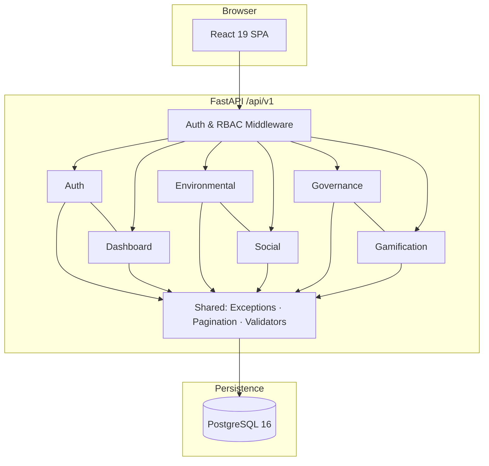

# EcoSphere – Enterprise ESG Management Platform

A full-stack, production-ready ESG (Environmental, Social, and Governance) platform built as a modular monolith. EcoSphere unifies carbon tracking, CSR engagement, compliance management, and employee gamification behind a single executive dashboard — with JWT authentication, role-based access control, and end-to-end test coverage.

> Aligned with [`SYSTEM_BLUEPRINT.md`](SYSTEM_BLUEPRINT.md) · Version **1.0.0**

---

## Demo Credentials

| Role | Email | Password |
|------|-------|----------|
| **Admin** | `admin@ecosphere.local` | `ChangeMe123!` |
| **Employee** | `firstname.lastname#@ecosphere.local` | `Employee123!` |

Admin is seeded by migration; employees are created by the demo seed script (`firstname.lastname1@ecosphere.local`, etc.). Change the admin password before any shared deployment.

---

## Screenshots

> Add images to `docs/screenshots/` to render below.

| Screen | Preview |
|--------|---------|
| Login |  |
| Executive Dashboard |  |
| Environmental |  |
| Social |  |
| Governance |  |
| Gamification |  |

---

## Project Highlights

- **Modular Monolith** — Feature-based boundaries in a single deployable unit
- **Clean Architecture** — Routers → Services → Repositories; no business logic in UI or ORM models
- **Service + Repository Pattern** — Testable domain services with dedicated data-access layers
- **JWT Authentication** — Access/refresh tokens, rotation, revocation, bcrypt hashing
- **RBAC** — Five roles, 20 permissions, server-side enforcement on every protected endpoint
- **Enterprise Dashboard** — Composite ESG score across all pillars
- **47/47 Tests Passing** — PostgreSQL integration tests with transactional isolation

---

## Features

| Area | Capabilities |
|------|-------------|
| **Executive Dashboard** | Composite ESG score, department ranking, carbon trends, goal progress, activity feed, contextual notifications, gamification widgets, permission-aware quick actions |
| **Authentication & RBAC** | Login, logout, refresh, profile, session; five roles with permission-gated routes |
| **Environmental** | Emission factors, carbon transactions (auto-calculated), department goals, product ESG profiles, analytics |
| **Social** | CSR activities, employee participation (join → submit → approve/reject), points, analytics |
| **Governance** | Policies, acknowledgements, audits, compliance issues (auto-overdue flagging), analytics |
| **Gamification** | Challenges, XP workflow, rule-based badges, reward redemption, leaderboards, analytics |
| **Notifications** | Dashboard alerts from goals, CSR, governance, and gamification state (no email delivery) |
| **Activity Logs** | Immutable mutation audit trail with indexed recent-activity feed |
| **Analytics** | Per-module dashboards plus executive aggregation |
| **Reports** | *Not implemented* — permissions seeded for future PDF/Excel export |

---

## Architecture



OpenAPI (`/docs`, `/redoc`) is available in **development** only and **disabled in production**.

---

## Business Workflow

1. **Measure** — Record carbon transactions against emission factors; emissions calculated automatically
2. **Target** — Set department environmental goals with deadlines and progress tracking
3. **Engage** — Publish CSR activities; employees join, submit proof, earn points on approval
4. **Govern** — Manage policies, acknowledgements, audits, and compliance issues to resolution
5. **Motivate** — Run sustainability challenges, award XP and badges, redeem rewards
6. **Report** — Executives view unified dashboard with composite ESG score and cross-module insights

---

## Tech Stack

| Layer | Technologies |
|-------|-------------|
| **Frontend** | React 19, TypeScript, Vite, TailwindCSS, shadcn/ui, TanStack Query, React Router, Recharts, Zod |
| **Backend** | Python 3.12, FastAPI, SQLAlchemy 2.x, Pydantic v2, Alembic, python-jose, bcrypt, Ruff, mypy, pytest |
| **Database** | PostgreSQL 16, JSONB, domain enums |
| **Infrastructure** | Docker Compose, GitHub Actions CI, Uvicorn |

---

## Implemented Modules

| Module | Backend | Frontend Route | Tests |
|--------|---------|----------------|-------|
| Authentication & RBAC | ✅ | `/login` | 7 |
| Executive Dashboard | ✅ | `/` | 6 |
| Environmental | ✅ | `/environmental` | 10 |
| Social | ✅ | `/social` | 7 |
| Governance | ✅ | `/governance` | 8 |
| Gamification | ✅ | `/gamification` | 8 |
| Health Check | ✅ | — | 1 |

Six Alembic migrations: foundation → environmental → social → governance → gamification → indexes.

---

## Repository Structure

```text
ecosphere-esg-platform/
├── backend/app/
│   ├── auth/                     # JWT, RBAC, session
│   ├── core/                     # Config, security, logging, events
│   ├── modules/
│   │   ├── dashboard/            # Executive aggregation
│   │   ├── environmental/        # Carbon, goals, product ESG
│   │   ├── social/               # CSR and participation
│   │   ├── governance/           # Policies, audits, compliance
│   │   └── gamification/         # Challenges, badges, rewards
│   ├── shared/                   # Exceptions, middleware, validators
│   └── tests/                    # 47 integration tests
├── frontend/src/
│   ├── app/                      # Router, layouts, guards
│   ├── modules/                  # Feature pages and API clients
│   └── shared/                   # UI library, hooks, services
├── scripts/                      # install.sh, setup-dev.sh
├── docker-compose.yml
└── .github/workflows/ci.yml
```

---

## Prerequisites

- Node.js 20+ · Python 3.12+ · PostgreSQL 16+ · Docker (optional)

---

## Quick Start

### Automated installation

```bash
chmod +x scripts/install.sh scripts/setup-dev.sh
./scripts/install.sh
```

### Manual setup

```bash
# Backend
cd backend
python3 -m venv .venv
source .venv/bin/activate
pip install -r requirements.txt
cp .env.example .env
alembic upgrade head
uvicorn app.main:app --reload

# Frontend (separate terminal)
cd frontend
npm install
cp .env.example .env
npm run dev
```

### Docker

```bash
cp backend/.env.example backend/.env
docker compose up --build
```

| Service | URL |
|---------|-----|
| API | http://localhost:8000 |
| API Docs (dev only) | http://localhost:8000/docs |
| Frontend (Vite) | http://localhost:5173 |
| Frontend (Docker) | http://localhost:3000 |

```bash
# After install — start both services
cd backend && source .venv/bin/activate && alembic upgrade head
cd .. && npm run dev
```

---

## Seed Data

```bash
cd backend
source .venv/bin/activate
python -m scripts.seed_data --reset
```

| Entity | Count | Entity | Count |
|--------|-------|--------|-------|
| Departments | 8 | Policies | 25 |
| Employees | 50 | Audits | 15 |
| Emission factors | 10 | Compliance issues | 35 |
| Carbon transactions | 100 | Challenges | 25 |
| Environmental goals | 8 | Challenge participations | 200 |
| Product ESG profiles | 8 | Badges / Rewards | 40 / 25 |
| CSR activities | 30 | Activity logs | 40 |
| CSR participations | 200 | | |

---

## API Reference

All endpoints use `/api/v1` and return `{ success, message, data, meta }`.

### Health & Authentication

| Method | Endpoint | Description |
|--------|----------|-------------|
| GET | `/health` | Health check |
| POST | `/auth/login` | Authenticate |
| POST | `/auth/refresh` | Rotate tokens |
| POST | `/auth/logout` | Revoke session |
| GET | `/auth/me` | User profile |
| GET | `/auth/session` | Session context |

### Dashboard

| Method | Endpoint | Description |
|--------|----------|-------------|
| GET | `/dashboard` | Executive dashboard |

### Environmental — `/environmental`

`departments` · `emission-factors` (CRUD) · `carbon-transactions` (CRUD + `/calculate`) · `goals` (CRUD) · `product-esg-profiles` (CRUD) · `analytics/dashboard`

### Social — `/social`

`departments` · `employees` · `csr-activities` (CRUD) · `participation` (CRUD + `/approve` + `/reject`) · `analytics/dashboard`

### Governance — `/governance`

`departments` · `employees` · `policies` (CRUD) · `policy-acknowledgements` · `audits` (CRUD) · `compliance-issues` (CRUD + `/close`) · `analytics/dashboard`

### Gamification — `/gamification`

`departments` · `employees` · `challenges` (CRUD) · `participation` (CRUD + submit/approve/reject) · `badges` (CRUD) · `employee-badges` · `rewards` (CRUD + `/redeem`) · `redemptions` · `leaderboard/company` · `leaderboard/department` · `analytics/dashboard`

---

## RBAC Roles

| Role | Scope |
|------|-------|
| ADMIN | Full platform access |
| ESG_MANAGER | Environmental, governance, gamification |
| HR_MANAGER | Social and engagement |
| AUDITOR | Governance and reporting (read) |
| EMPLOYEE | Participation and read-scoped access |

Server-side enforcement on all protected endpoints. Frontend checks are UI-only.

---

## Testing

| Check | Result |
|-------|--------|
| Backend tests (`pytest`) | **47 / 47 passed** |
| Ruff (`ruff check app`) | Passed |
| TypeScript (`npm run typecheck`) | Passed |
| Production build (`npm run build`) | Passed |

```bash
npm run lint && npm run typecheck && npm run test && npm run build
```

CI runs lint, migrations, tests, and build via GitHub Actions against PostgreSQL 16.

---

## Development Commands

```bash
npm run dev              # Backend + frontend concurrently
npm run lint             # Ruff, mypy, ESLint
npm run typecheck        # TypeScript validation
npm run test             # Backend integration tests
npm run build            # Production frontend build
```

---

## Environment Variables

**Backend** (`backend/.env`): `DATABASE_URL` · `JWT_SECRET_KEY` (min 32 chars) · `ENVIRONMENT` · `CORS_ORIGINS` · `LOG_LEVEL`

Production rejects default secrets and disables OpenAPI docs.

**Frontend** (`frontend/.env`): `VITE_API_BASE_URL` (default `/api/v1`)

---

## Future Improvements

- Reports module (PDF/Excel export, regulatory templates)
- File upload service for CSR and challenge evidence
- AI insights via provider-agnostic LLM integration
- Administration UI for users, departments, and ESG settings
- Email notifications for domain events
- Multi-organization tenant isolation
- SSO / OIDC enterprise identity

---

## Documentation

| Document | Purpose |
|----------|---------|
| [`SYSTEM_BLUEPRINT.md`](SYSTEM_BLUEPRINT.md) | Architecture source of truth |
| [`RELEASE_NOTES.md`](RELEASE_NOTES.md) | v1.0.0 release notes and upgrade guide |
| `/docs` (dev only) | Interactive OpenAPI |

---

## License

Proprietary – EcoSphere Enterprise ESG Platform
